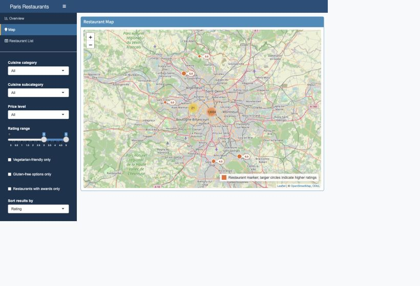

# Paris Restaurant Recommendation Dashboard

This project is an interactive R Shiny dashboard for exploring restaurant recommendations in Paris. It was converted from an R Notebook into a deployable Shiny script so the app can be run directly and hosted as a finished product.

## Features

- Filter restaurants by cuisine category, cuisine subcategory, price level, rating range, vegetarian-friendly options, gluten-free options, and awards.
- View summary metrics and top recommended restaurants in a dedicated overview tab.
- Explore restaurants on an interactive Leaflet map with hover labels and detailed popups.
- Search, sort, and paginate the restaurant list with DT.

## Project Structure

```text
.
├── app.R
├── cleaned_paris_restaurants.RData
├── images/
│   └── map-page.png
├── R_app.Rmd
├── Programming_R_App_Lin TONG.pdf
└── README.md
```

## How to Run

Install the required R packages:

```r
install.packages(c("shiny", "shinydashboard", "leaflet", "dplyr", "DT", "scales"))
```

Run the application from this project folder:

```r
shiny::runApp()
```

Or from the terminal:

```bash
Rscript -e "shiny::runApp('.', launch.browser = TRUE)"
```

## App Preview

The map view shows filtered Paris restaurants with rating labels beside each marker. Click a marker to view the restaurant name, cuisine, price level, review count, and awards.



## Deployment

The app can be deployed to shinyapps.io with:

```r
rsconnect::deployApp()
```

The main deployable file is `app.R`; the notebook is kept only as the original development version.
